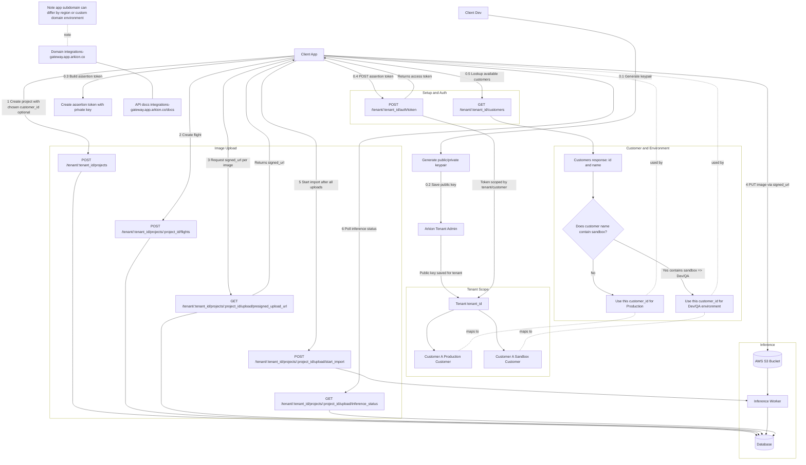

# Image Upload Flow Overview

```mermaid
%%{init: {'flowchart': {'nodeSpacing': 55, 'rankSpacing': 75}}}%%
flowchart TB
	Client[Client Dev]
	TenantAdmin[Arkion Tenant Admin]
	KeyPair[Generate public/private keypair]
	ClientApp[Client App]
	AssertionToken[Create assertion token with private key]
	ClientApp -->|0.3 Build assertion token| AssertionToken
	Domain[Domain integrations-gateway.app.arkion.co]
	ApiDocs[API docs integrations-gateway.app.arkion.co/docs]
	DomainNote[Note app subdomain can differ by region or custom domain environment]

	Client ~~~ ClientApp
	Domain --- ApiDocs
	DomainNote -. note .- Domain

	subgraph TENANT[Tenant Scope]
		Tenant[Tenant tenant_id]
		CustProd[Customer A Production Customer]
		CustSandbox[Customer A Sandbox Customer]
		Tenant --> CustProd
		Tenant --> CustSandbox
	end

	subgraph CUSTOMERENV[Customer and Environment]
		CustList[Customers response: id and name]
		NameCheck{Does customer name contain sandbox?}
		UseProd[Use this customer_id for Production]
		UseSandbox[Use this customer_id for Dev/QA environment]
		CustList --> NameCheck
		NameCheck -->|No| UseProd
		NameCheck -->|Yes contains sandbox => Dev/QA| UseSandbox
	end

	subgraph SETUPAUTH[Setup and Auth]
		Auth[POST /tenant/:tenant_id/auth/token]
		GetCustomers[GET /tenant/:tenant_id/customers]
	end

	subgraph IMAGEUPLOAD[Image Upload]
		CreateProject[POST /tenant/:tenant_id/projects]
		CreateFlight[POST /tenant/:tenant_id/projects/:project_id/flights]
		GetSignedUrl[GET /tenant/:tenant_id/projects/:project_id/upload/presigned_upload_url]
		StartImport[POST /tenant/:tenant_id/projects/:project_id/upload/start_import]
		InferenceStatus[GET /tenant/:tenant_id/projects/:project_id/upload/inference_status]
	end

	GetCustomers ~~~ CreateProject ~~~ CreateFlight ~~~ GetSignedUrl ~~~ StartImport ~~~ InferenceStatus
	UseProd -. maps to .- CustProd
	UseSandbox -. maps to .- CustSandbox
	UseProd -. used by .- ClientApp
	UseSandbox -. used by .- ClientApp

	subgraph AWS[Inference]
		S3[(AWS S3 Bucket)]
		Worker[Inference Worker]
		Db[(Database)]
	end

	Client -->|0.1 Generate keypair| KeyPair
	KeyPair -->|0.2 Save public key| TenantAdmin
	TenantAdmin -->|Public key saved for tenant| Tenant
	ClientApp -->|0.4 POST assertion token| Auth
    
	Auth -->|Returns access token| ClientApp
	Auth -->|Token scoped by tenant/customer| Tenant

	ClientApp -->|0.5 Lookup available customers| GetCustomers
	GetCustomers --> CustList

	ClientApp -->|1 Create project with chosen customer_id optional| CreateProject
	CreateProject --> Db

	ClientApp -->|2 Create flight| CreateFlight
	CreateFlight --> Db

	ClientApp -->|3 Request signed_url per image| GetSignedUrl
	GetSignedUrl -->|Returns signed_url| ClientApp
	GetSignedUrl --> Db

	ClientApp -->|4 PUT image via signed_url| S3

	ClientApp -->|5 Start import after all uploads| StartImport
	StartImport --> Worker
	Worker --> Db
	S3 --> Worker

	ClientApp -->|6 Poll inference status| InferenceStatus
	InferenceStatus --> Db

	style TENANT fill:transparent
	style CUSTOMERENV fill:transparent
	style SETUPAUTH fill:transparent
	style IMAGEUPLOAD fill:transparent
	style AWS fill:transparent

```
